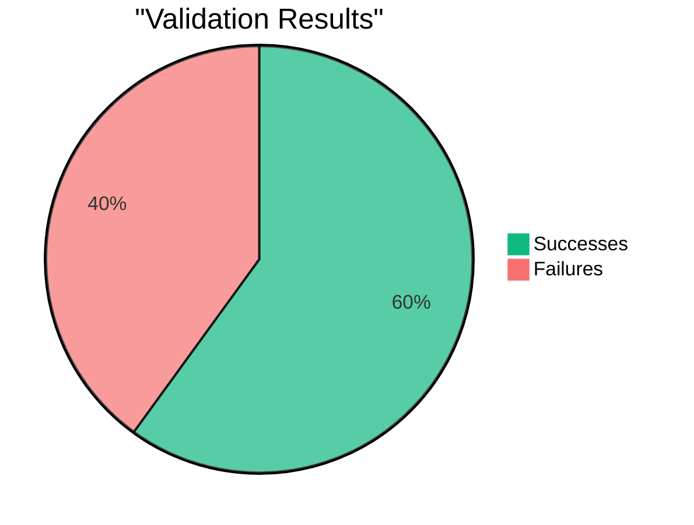

# Report 04/08/2025 17:39:37

## Rapport de Validation

| Total | Succès | Échecs | Taux de succès | Taux d'echec |
| ----- | ------ | ------ | -------------- | ------------ |
| 5     | 3      | 2      | 60.0%          | 40.0%        |

### Success

| From  | User                                                                                     | Total Collateral | Total Debt    | Liquidation Threshold | LTV  | Health Factor             |
| ----- | ---------------------------------------------------------------------------------------- | ---------------- | ------------- | --------------------- | ---- | ------------------------- |
| CHAIN | [0x0d0e...4d9b](https://defisim.xyz/?address=0x0d0e319054c5a87f4631dd488e37f44d696e4d9b) | 45363501.7178    | 16631630.4842 | 8300                  | 8000 | **2.2639**                |
| CALC  | [0x0d0e...4d9b](https://defisim.xyz/?address=0x0d0e319054c5a87f4631dd488e37f44d696e4d9b) | 45363501.6600    | 16631581.4528 | 8300                  | 8000 | **2.2639**                |
| CHAIN | [0xa0d9...fc24](https://defisim.xyz/?address=0xa0d9c1e9e48ca30c8d8c3b5d69ff5dc1f6dffc24) | 0.0000           | 0.0000        | 0                     | 0    | **1.157920892373162e+59** |
| CALC  | [0xa0d9...fc24](https://defisim.xyz/?address=0xa0d9c1e9e48ca30c8d8c3b5d69ff5dc1f6dffc24) | 0.0000           | 0.0000        | 0                     | 0    | **1.157920892373162e+59** |
| CHAIN | [0xf564...4373](https://defisim.xyz/?address=0xf564ed378b90b40c82dd909358b03ec616404373) | 111.3995         | 0.0000        | 8300                  | 8000 | **1.157920892373162e+59** |
| CALC  | [0xf564...4373](https://defisim.xyz/?address=0xf564ed378b90b40c82dd909358b03ec616404373) | 455.8722         | 0.0000        | 8300                  | 8000 | **1.157920892373162e+59** |

### Failed

| From  | User                                                                                     | Total Collateral | Total Debt | Liquidation Threshold | LTV  | Health Factor |
| ----- | ---------------------------------------------------------------------------------------- | ---------------- | ---------- | --------------------- | ---- | ------------- |
| CHAIN | [0x25a7...2049](https://defisim.xyz/?address=0x25a7cc2a243cdb9a4475d3d86d51d3c60df72049) | 8292.2448        | 5979.8919  | 8300                  | 8000 | **1.1510**    |
| CALC  | [0x25a7...2049](https://defisim.xyz/?address=0x25a7cc2a243cdb9a4475d3d86d51d3c60df72049) | 0.0000           | 18284.1074 | 0                     | 0    | **0.0000**    |
| CHAIN | [0xa089...3c26](https://defisim.xyz/?address=0xa089f783c32f694d4cea66fd03c88971766a3c26) | 55328.5183       | 26181.2782 | 7800                  | 7500 | **1.6484**    |
| CALC  | [0xa089...3c26](https://defisim.xyz/?address=0xa089f783c32f694d4cea66fd03c88971766a3c26) | 76660.0139       | 26181.2782 | 7800                  | 7500 | **2.2839**    |