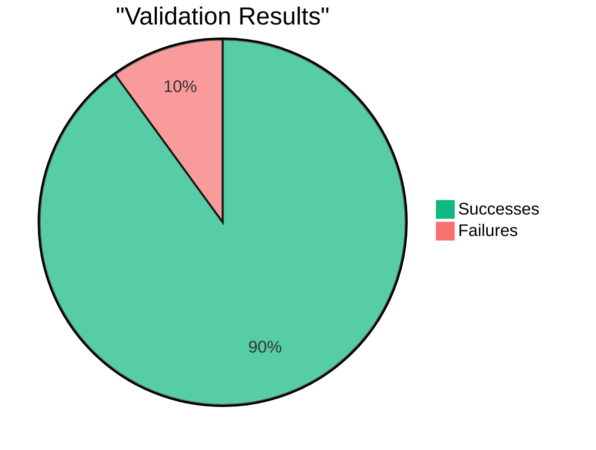

# Report 02/08/2025 12:56:43

## Rapport de Validation

| Total | Succès | Échecs | Taux de succès | Taux d'echec |
| ----- | ------ | ------ | -------------- | ------------ |
| 10    | 9      | 1      | 90.0%          | 10.0%        |

### Success

| From  | User                                                                                     | Total Collateral | Total Debt  | Liquidation Threshold | LTV  | Health Factor    |
| ----- | ---------------------------------------------------------------------------------------- | ---------------- | ----------- | --------------------- | ---- | ---------------- |
| CHAIN | [0x0000...e46f](https://defisim.xyz/?address=0x00000002d88f9b3f4eb303564817fff4adcde46f) | 275.0362         | 114.6079    | 7898                  | 7500 | **1.8954**       |
| CALC  | [0x0000...e46f](https://defisim.xyz/?address=0x00000002d88f9b3f4eb303564817fff4adcde46f) | 275.0362         | 114.6079    | 7898                  | 7500 | **1.8954**       |
| CHAIN | [0x0000...832d](https://defisim.xyz/?address=0x0000007ca619ae568b42cde96625c28a827a832d) | 2.6030           | 2.1585      | 8300                  | 8000 | **1.0009**       |
| CALC  | [0x0000...832d](https://defisim.xyz/?address=0x0000007ca619ae568b42cde96625c28a827a832d) | 2.6030           | 2.1585      | 8300                  | 8000 | **1.0009**       |
| CHAIN | [0x0000...5b3d](https://defisim.xyz/?address=0x000000c77ab4952aa5c43ee8047bca9ca7265b3d) | 38848.0878       | 20952.0347  | 7800                  | 7300 | **1.4462**       |
| CALC  | [0x0000...5b3d](https://defisim.xyz/?address=0x000000c77ab4952aa5c43ee8047bca9ca7265b3d) | 38848.0866       | 20952.0347  | 7800                  | 7300 | **1.4462**       |
| CHAIN | [0x0000...4d56](https://defisim.xyz/?address=0x000004db6ad30b94013098ccde47d7492cab4d56) | 0.0390           | 0.0000      | 8300                  | 8000 | **1080361.6667** |
| CALC  | [0x0000...4d56](https://defisim.xyz/?address=0x000004db6ad30b94013098ccde47d7492cab4d56) | 0.0390           | 0.0000      | 8300                  | 8000 | **1080361.7533** |
| CHAIN | [0x0000...1112](https://defisim.xyz/?address=0x00000655388d579492cf53ca6f490eaa30711112) | 0.7686           | 0.3048      | 8300                  | 8000 | **2.0929**       |
| CALC  | [0x0000...1112](https://defisim.xyz/?address=0x00000655388d579492cf53ca6f490eaa30711112) | 0.7686           | 0.3048      | 8300                  | 8000 | **2.0929**       |
| CHAIN | [0x0000...0000](https://defisim.xyz/?address=0x00005ff7b4e62b6b868d36809f8a30c85a6d0000) | 355120.5687      | 332447.1110 | 9500                  | 9300 | **1.0148**       |
| CALC  | [0x0000...0000](https://defisim.xyz/?address=0x00005ff7b4e62b6b868d36809f8a30c85a6d0000) | 355120.5687      | 332447.1110 | 9500                  | 9300 | **1.0148**       |
| CHAIN | [0x0000...1acf](https://defisim.xyz/?address=0x0000ce08fa224696a819877070bf378e8b131acf) | 10.5723          | 5.3875      | 7800                  | 7500 | **1.5306**       |
| CALC  | [0x0000...1acf](https://defisim.xyz/?address=0x0000ce08fa224696a819877070bf378e8b131acf) | 10.5723          | 5.3875      | 7800                  | 7500 | **1.5306**       |
| CHAIN | [0x0001...8375](https://defisim.xyz/?address=0x000175c85ace85cd46ffe3042cc814b213698375) | 0.0041           | 0.0002      | 8300                  | 8000 | **18.7267**      |
| CALC  | [0x0001...8375](https://defisim.xyz/?address=0x000175c85ace85cd46ffe3042cc814b213698375) | 0.0041           | 0.0002      | 8300                  | 8000 | **18.7267**      |
| CHAIN | [0x0003...48e1](https://defisim.xyz/?address=0x000317b493388d6d12b82ac6854b031dc33c48e1) | 0.0105           | 0.0000      | 7800                  | 7500 | **209.6103**     |
| CALC  | [0x0003...48e1](https://defisim.xyz/?address=0x000317b493388d6d12b82ac6854b031dc33c48e1) | 0.0105           | 0.0000      | 7800                  | 7500 | **209.5903**     |

### Failed

| From  | User                                                                                     | Total Collateral | Total Debt | Liquidation Threshold | LTV  | Health Factor |
| ----- | ---------------------------------------------------------------------------------------- | ---------------- | ---------- | --------------------- | ---- | ------------- |
| CHAIN | [0x0000...704f](https://defisim.xyz/?address=0x0000f25762379fc327cf84bfc01cd7d528ae704f) | 0.0005           | 0.0000     | 7800                  | 7500 | **10.0483**   |
| CALC  | [0x0000...704f](https://defisim.xyz/?address=0x0000f25762379fc327cf84bfc01cd7d528ae704f) | 0.0005           | 0.0000     | 7800                  | 7500 | **10.0288**   |